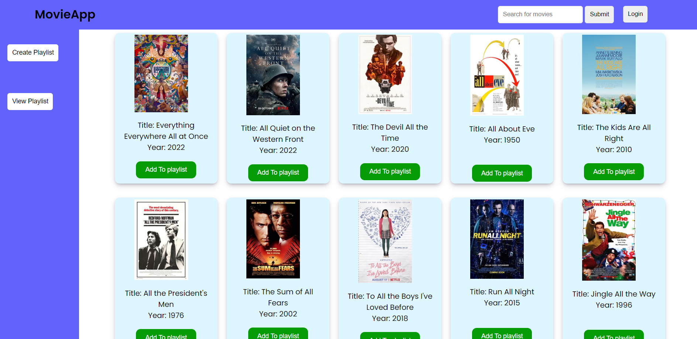
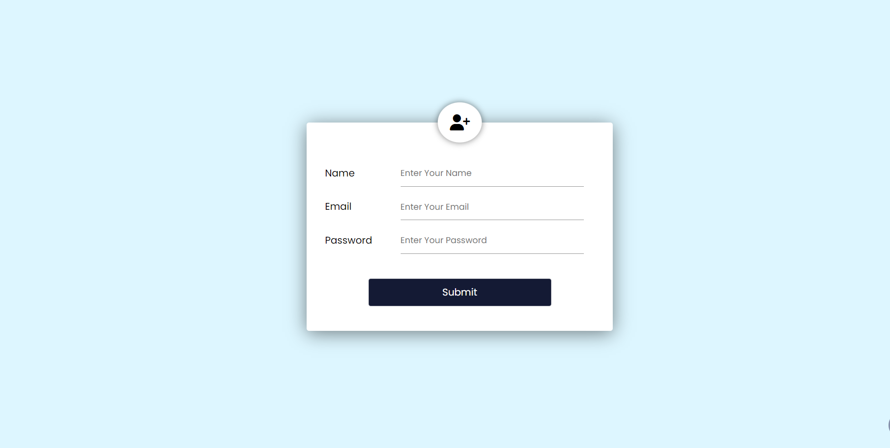
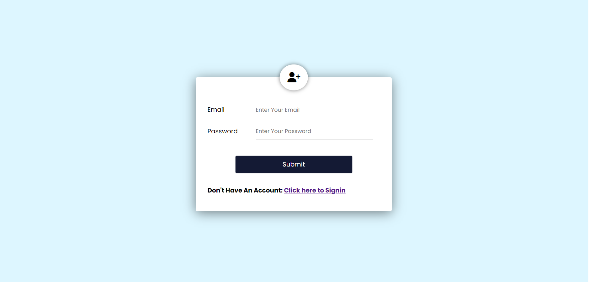
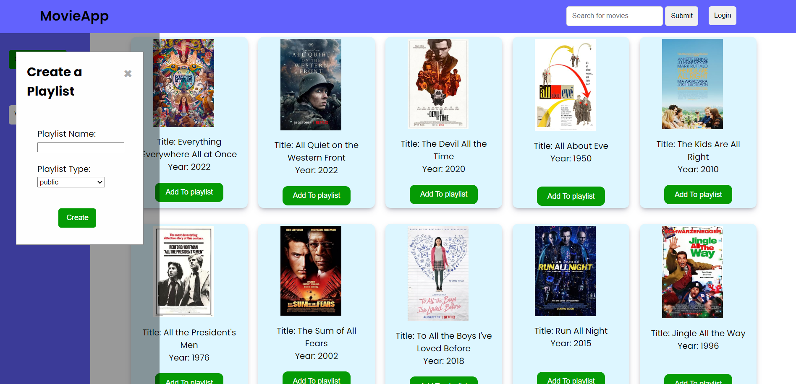
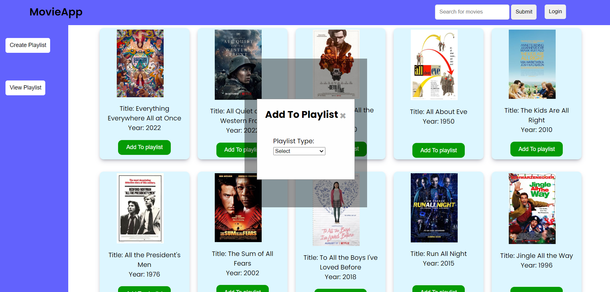
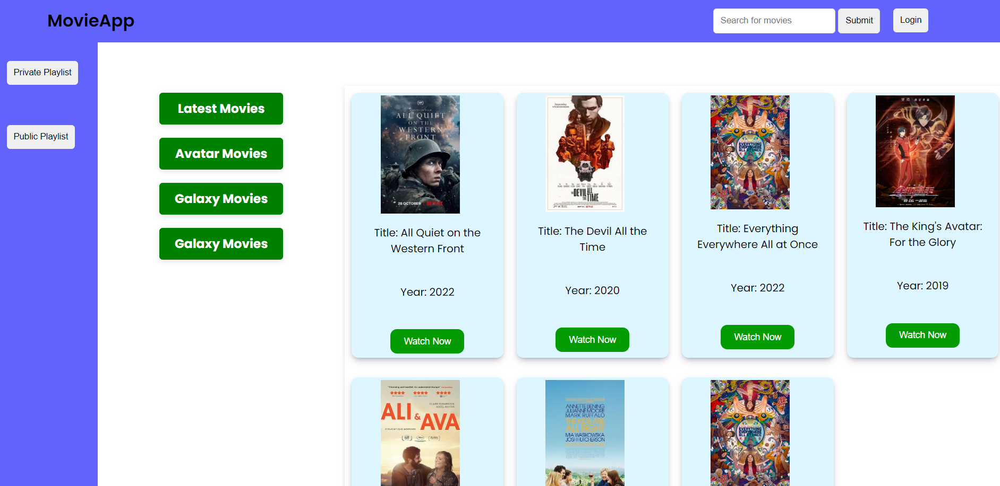

# [MovieApp]

It's a Movie App website inn which user can create his/her Public or private playlist , add movies innto it and also see the perticular playlist information.

# Frontend Deployed Link :- https://64cf395b17e8c41db748a3ad--velvety-bunny-6808fd.netlify.app/

# Backend Deployed Link :- https://movieapp-1979.onrender.com/

## Tech Stack

**Client:** HTML | CSS | Javascript

**Server:** Node.js | Express.js

**Database:** MongoDB

**npm packages:** bcrypt | cors | dotev | express | jsonwebtoken | mongoose | node-fetch | nodemon

**github:** To maintain repository and collabration and version control.

**VS Code:** To write HTML,CSS and JavaScript code.

**Google Chrome :** To check the functionality and run the code.

# Getting Started

### Prerequisites

- npm
  ```sh
  npm install
  ```

### Installation

1. Clone the repo

   ```sh
   git clone https://github.com/Yogita2021/MovieApp.git
   ```

2. Run api only

   ```sh
   npm start
   ```

3. Open http://localhost:8000 to backend run in the browser

## Frontend Part

- Home Page
- Login/Signup
- View Playlist Page

## Backend Part

- Authentication using JWT
- Routes for get all the movies, search movies by its title , create playlist , Add movie to the playlist , sign up and login ,get movies from  
  perticular Playlist

## Database

- MongoDB

## Features

- User can able to login and signup
- User can search perticular movie
- User can create both public and private playlists
- User can able to Add movie to playlists
- User can see all the movies from perticular playlist
- Only authorized user can see private playlist

<br>

## Home Page



## Registeration Page



## Login Page



## Create Playlist



## Add Movie to the playlist



## View All the Playlist Information


